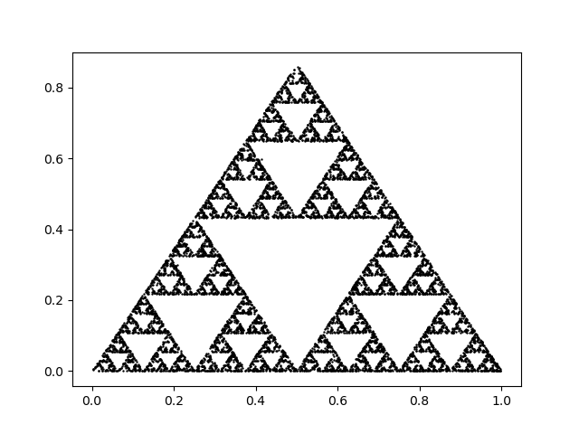

# Chaos Game

## Make fractals with the Chaos game
* The chaos game is a method for iteratively generating fractals
* First you start with a polygon, and a random point within the polygon
* Then for a number of iterations you select a random vertex and move the point a consistent fraction of the distance to it (usually 0.5)
* This sometimes creates fractals, depending on the iteration conditions and the polygon used

